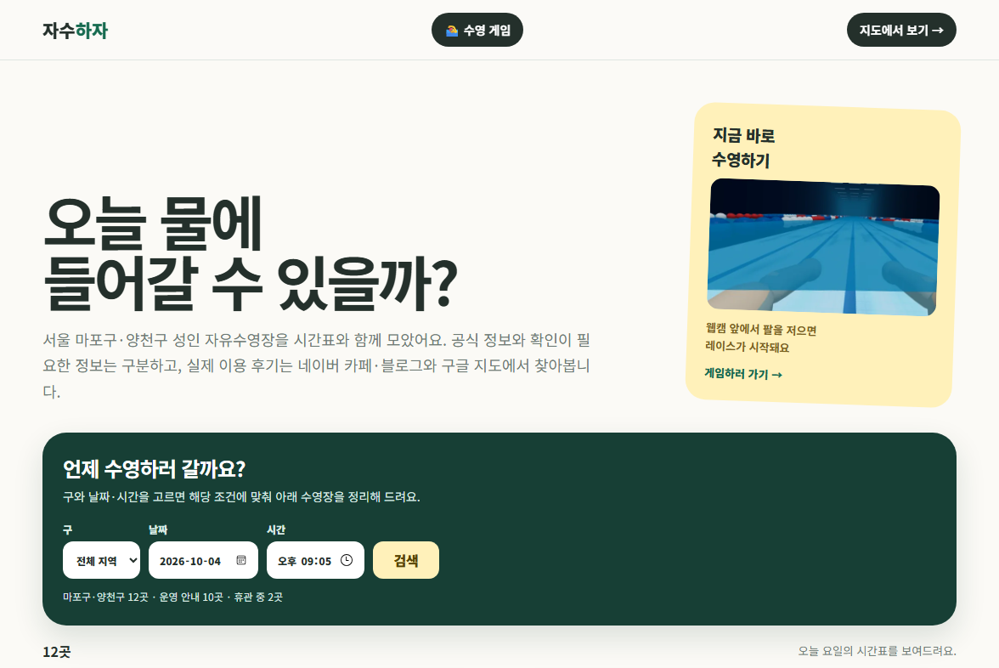
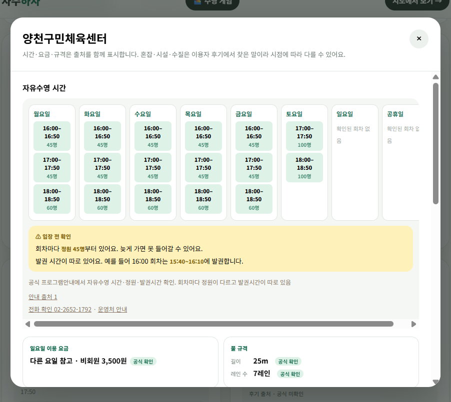
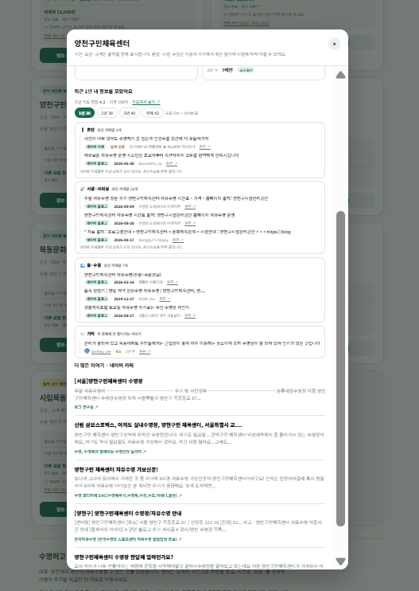
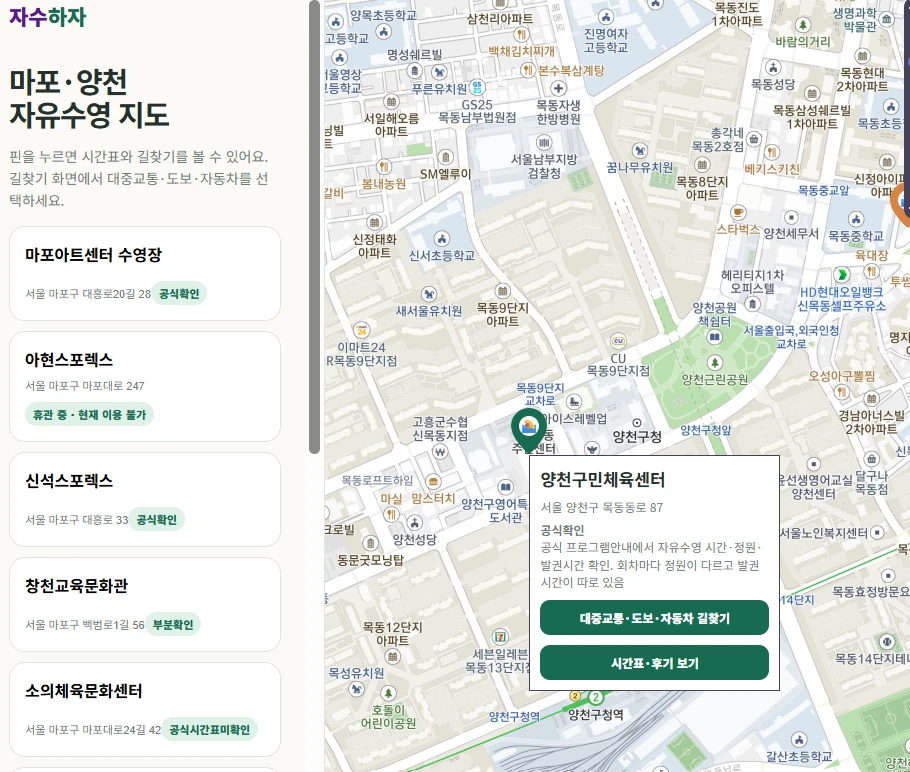

# 자수하자 — 오늘 갈 수 있는 자유수영장 찾기

> 서울 마포구·양천구에서 **원하는 날짜·시간에 성인 자유수영이 가능한 수영장**을 찾아주는 웹서비스.
> 시간표·요금은 공식 자료에서, 혼잡·시설·수질 같은 체감 정보는 최근 이용자 후기에서 가져와 **출처를 구분해** 보여줍니다.

`JavaScript` `HTML/CSS` `Vercel Serverless` `Python` `TMAP API` `Naver Search API` `Google Places API` `MediaPipe`

**서비스**: https://mulddae-cyan.vercel.app · **기간**: 2026.08 ~ 2026.09 (개인 프로젝트)



---

## 1. 문제 정의

자유수영은 시설마다 회차·요금·휴관일이 다르고, 공지가 이미지나 게시판에 흩어져 있습니다.
"오늘 퇴근 후 갈 수 있는 곳"을 알려면 여러 시설 홈페이지를 하나씩 들어가 봐야 합니다.
혼잡도나 샤워실 상태처럼 홈페이지로는 알 수 없는 정보는 카페·블로그 후기를 따로 찾아야 합니다.

## 2. 주요 기능

| 기능 | 설명 |
|---|---|
| 시간 기반 검색 | 구·날짜·시간을 고르면 이용 가능 → 확인 필요 → 회차 없음 → 휴관 순으로 정렬 |
| 공식 정보 | 회차·요금·레인·수심. 공식 자료가 없으면 `참고 정보 · 공식 미확인`으로 표시 |
| 후기 요약 | 혼잡·시설·샤워실·수질 주제별로 근거 문장과 날짜·출처를 함께 표시 |
| 지도 | 시설 위치 확인 후 카카오맵 길찾기로 연결 |
| 수영 게임 | 웹캠 포즈 인식으로 팔 동작을 따라 하는 미니 게임 (MediaPipe + Three.js) |

| 상세 – 시간표 | 상세 – 후기 | 지도 |
|---|---|---|
|  |  |  |

## 3. 데이터

| 데이터 | 규모 | 출처 |
|---|---|---|
| `수영장.csv` | 12개 시설 (마포 6 · 양천 6, 휴관 2) | 시설 공식 홈페이지, 서울시 생활체육포털 |
| `자유수영시간.csv` | 50개 회차 | 시설 공식 시간표 (확인일 기록) |
| `시설규격.csv` | 레인·수심·물 종류 | 항목별 출처 기록 |
| 후기 | 호출 시점에 조회 | 네이버 카페·블로그 검색 API, Google Places API |

후기 데이터는 출처마다 한계가 달라 교차해서 사용했습니다.

| | 네이버 카페 | 네이버 블로그 | 구글 지도 |
|---|---|---|---|
| 본문 | 요약만 (평균 142자) | 요약만 | 전문 |
| 작성 날짜 | 없음 | 있음 | 상대 표시 |
| 최신순 정렬 | 가능 | 가능 | 불가 |
| 개수 | 수십~수백 | 수십 | 시설당 5개 |
| 저장 | 가능 | 가능 | 정책상 금지 |

## 4. 핵심 의사결정

- **크롤링 대신 공식 API**: 네이버 카페·블로그의 robots.txt에 AI 목적 접근 금지가 명시되어 있어 수집하지 않고 검색 API를 사용했습니다.
- **별점 대신 근거 문장**: API가 본문이 아닌 142자 요약만 준다는 걸 확인하고, 점수를 매기는 대신 판단 근거가 된 문장을 그대로 보여주도록 바꿨습니다.
- **공식 정보와 후기를 "변하는 속도"로 분리**: 정답이 하나인 정보(시간·요금)는 공식 자료만, 사람마다 다른 정보(혼잡·쾌적)만 후기로 다룹니다.
- **후기 기간 3년 → 1년**: 근거 없이 정해진 값이었기 때문에, 1년 이내 문장이 주제당 3개 이상 남는지 실측한 뒤 바꿨습니다.
- **도보 시간 계산 포기**: TMAP 보행자 경로 API의 하루 1,000회 제한에 실제로 걸려, 계산 대신 길찾기 앱 연결로 설계를 바꿨습니다.
- **API 비용 상한 설정**: Google Places 기본 할당량을 하루 50회로 낮춰 과금 사고 위험을 제한했습니다.

## 5. 측정 결과

후기 37건으로 정답표를 만들고(AI 초안 → 직접 검수로 17칸 중 5칸 수정), 키워드 기반 분류를 평가했습니다.

| 지표 | 값 |
|---|---|
| 정밀도 | 86% (7칸 중 6칸) |
| 재현율 | 40% (15칸 중 6칸) |
| 시설 쾌적도 재현율 | 0% (5칸 모두 누락) |

문제는 잘못 잡는 것(오탐)이 아니라 **놓치는 것(누락)** 이었습니다. 측정 스크립트는 `scripts/정확도측정.py`, 결과는 `analysis/results/`에 있습니다.

## 6. 저장소 구조

```
jasuhaja/
├── index.html            # 메인: 검색·추천, 카드, 주간 플래너, 상세창
├── map.html              # 지도 (TMAP) + 카카오맵 길찾기
├── 수영게임.html          # 웹캠 포즈 인식 게임
├── 수영장.csv · 자유수영시간.csv · 시설규격.csv
├── api/                  # Vercel 서버리스: 네이버 검색·구글 리뷰 프록시 (API 키 숨김)
├── scripts/              # 데이터 보강, 후기 표본·정답표, 정확도 측정, 회귀 검증
├── analysis/             # 정답표(gold)와 측정 결과
├── docs/                 # 작업기록, 포트폴리오 기록(의사결정·검증), 화면 평가
└── portfolio/            # 프로젝트 포트폴리오 페이지와 스크린샷
```

## 7. 실행 방법

```bash
cp .env.example .env.local          # API 키 입력
cp tmap-key.example.js tmap-key.js  # TMAP 앱키 입력
node scripts/검색정렬검증.cjs        # CSV·정렬·요금·휴관 회귀 검증
```

API 키 파일은 `.gitignore`로 제외되어 있고, Vercel 배포 시에는 환경 변수에서 키 파일을 만듭니다 (`npm run build`).

## 8. 한계와 다음 과제

- 네이버 API가 본문을 주지 않아 후기 분석 재현율이 낮습니다. 문장 단위 분류 모델을 비교하는 실험을 설계해 두었습니다 (`docs/후기분석-실험설계.md`).
- 시간표가 이미지 공지로만 올라오는 시설이 있어 휴관·변경을 놓칠 수 있습니다. 실제로 아현스포렉스의 대수선 공지를 한 번 놓쳤다가 재검증에서 바로잡았습니다.
- 대상 지역이 마포·양천 2개 구로 한정되어 있습니다.

## 9. AI 활용 방식

Claude Code·Codex로 구현했고, 판단과 검증은 직접 했습니다. AI가 틀렸던 12건과 그걸 잡아낸 과정, 실제로 쓴 프롬프트는 [`docs/포트폴리오-기록.md`](docs/포트폴리오-기록.md)에 남겨 두었습니다.
